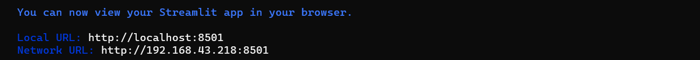

# GradCAM-Modification
 Deep Learning Using GradCAM

# Deskripsi
 Pada dokumen ini akan dijelaskan teknis penerapan user interface menggunakan streamlit yang akan dijalankan secara lokal. Dokumentasi teknis ini ditujukan untuk orang-orang yang akan menggunakan cara yang serupa dengan program kami. 

# Implementasi 
 1.Langkah pertama unduh program pada link berikut:   
    https://github.com/brada1604/GradCAM-Modification    
 2.Setelah itu jalankan kode dengan menggunakan perintah “streamlit run beranda.py” pada terminal  
      
   
