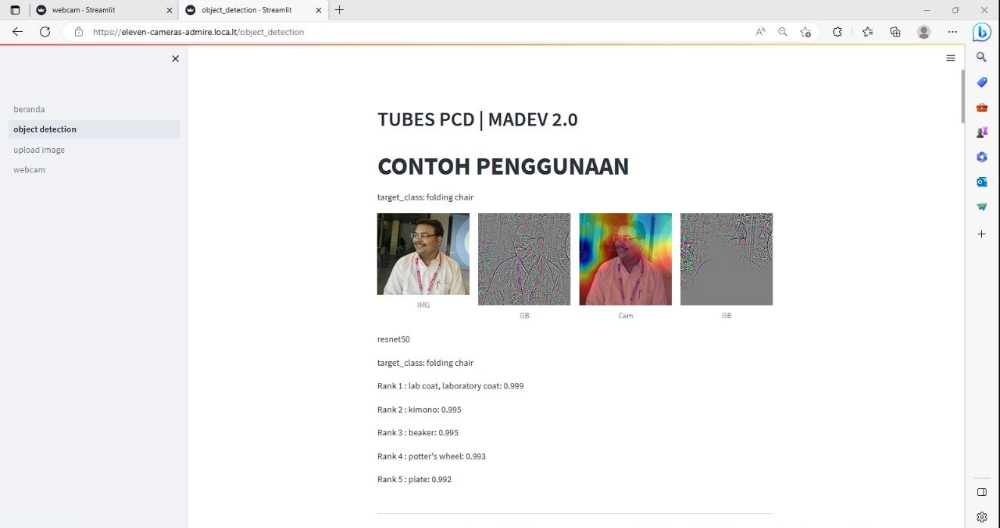
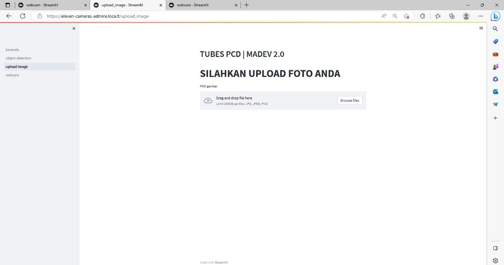
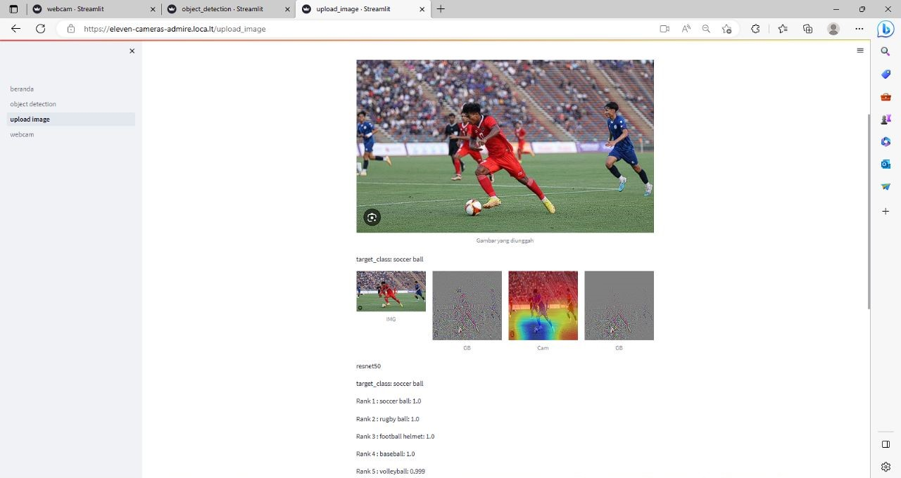
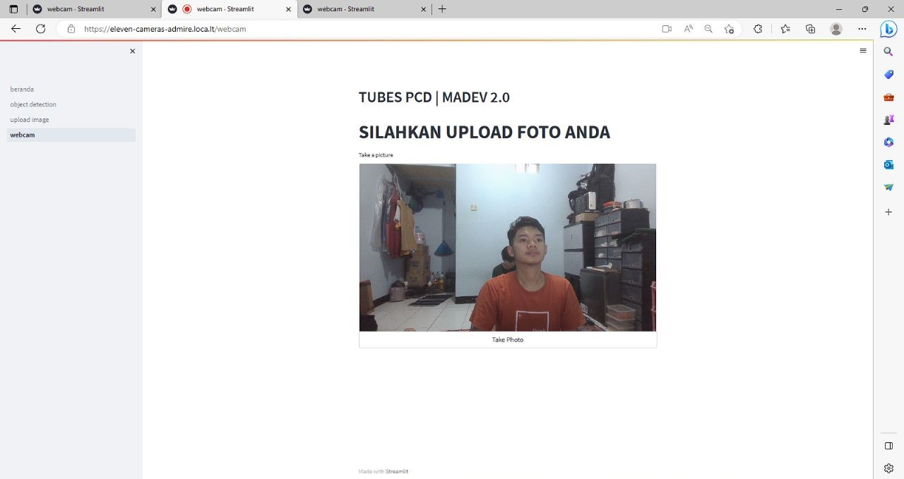
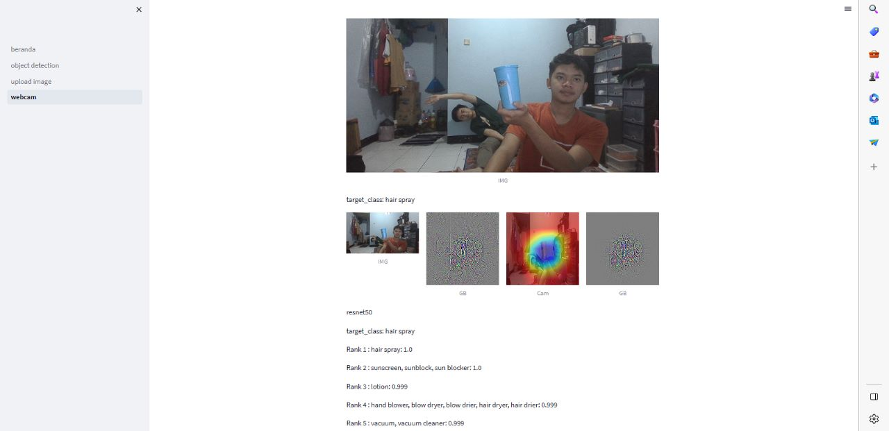

# GradCAM-Modification
 Deep Learning Using GradCAM

# Deskripsi
 Pada dokumen ini akan dijelaskan teknis penerapan user interface menggunakan streamlit yang akan dijalankan secara lokal. Dokumentasi teknis ini ditujukan untuk orang-orang yang akan menggunakan cara yang serupa dengan program kami. 

# Implementasi 
 1.Langkah pertama unduh program pada link berikut:   
    https://github.com/brada1604/GradCAM-Modification    
 2.Setelah itu jalankan kode dengan menggunakan perintah “streamlit run beranda.py” pada terminal, maka akan tampil seperti gambar berikut:    
        
 3.Setelah mendapatkan URL maka akan ditampilkan halaman beranda yang berisi profile dari kelompok kami yaitu, MADEV 2.0
        
 4.Pada menu sidebar terdapat page object detection, pada page ini akan ditampilkan hasil dari metode Grad-CAM dengan menampilkan   heatmap beserta target class pada    citra. Akhirnya akan diketahui target class yang nilainya paling besar merepresentasikan objek pada citra sehingga dapat divalidasi.  
        
 5.Setelah page object detection terdapat page upload image, pada page ini citra berasal dari hasil upload dari komputer. Setelah di upload maka citra akan     ditampilkan dan diproses sehingga menghasilkan hasil yang sama seperti penjelasan pada object detection.  
        
          
 6.Pada menu sidebar yang paling terakhir adalah page webcam, pada page ini citra berasal dari livecam hasil dari modifikasi selain website streamlit yang   ditampilkan. Setelah memfoto citra maka akan langsung diproses sehingga menghasilkan hasil yang sama seperti penjelasan pada object detection.  
        
      
   
